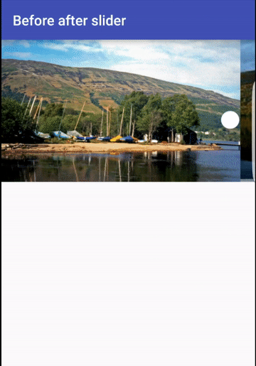

# <h1 align="center">Before and after image slider</h1>
<p align="center">
  
</p>

<h1> instructions </h1>

```xml
<!-- Inside your xml layout -->

  <com.awesomethings.beforeafterslider.Slider
        android:id="@+id/mySlider"
        android:layout_width="match_parent"
        android:layout_height="300dp"
        app:slider_thumb="@mipmap/white_circle"
        >
  </com.awesomethings.beforeafterslider.Slider>
```

```kotlin
  //Inside java
  
  mySlider.setBeforeImage(imgUrl1).setAfterImage(imgUrl2)  
```

```kotlin
  //to change slider_thumb programmaticaly
  mySlider.setSliderThumb(yourDrawable)
```

<h1>Maven dependency</h1>
```groovy
<dependency>
  <groupId>com.awesomethings.beforeafterslider</groupId>
  <artifactId>beforeafterslider</artifactId>
  <version>1.0.2</version>
  <type>pom</type>
</dependency>
```
<h1>Gradle dependency</h1>

```groovy        
  compile 'com.awesomethings.beforeafterslider:beforeafterslider:1.0.2'
```
